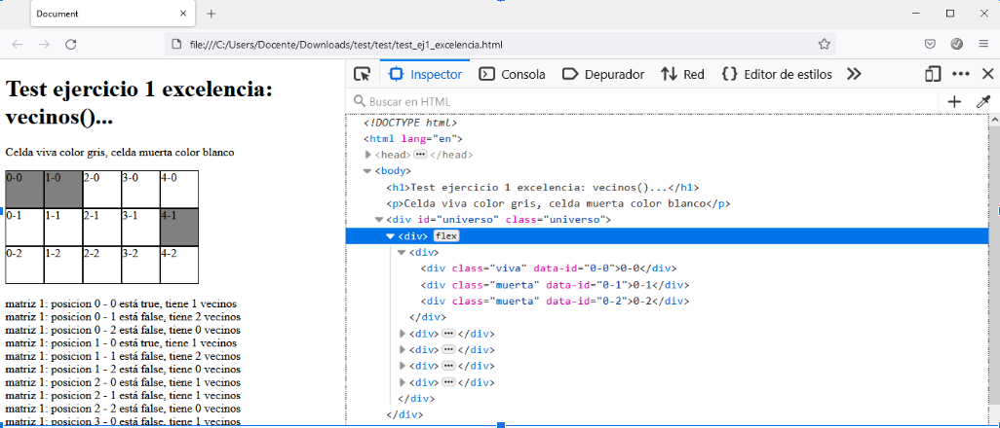
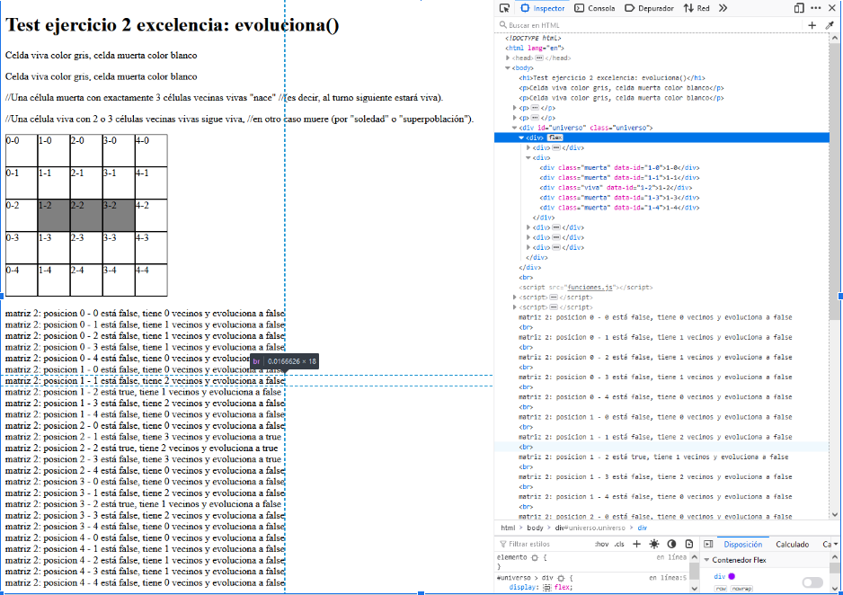
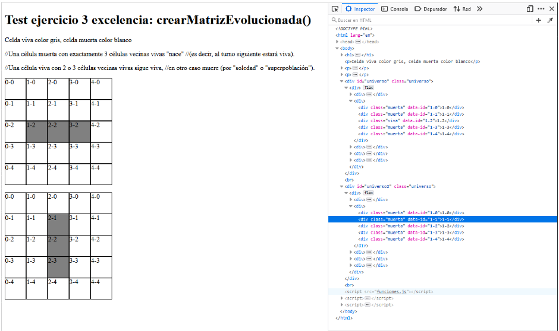

# Exercici 7 - EL joc de la Vida

https://ca.wikipedia.org/wiki/Joc_de_la_vida

https://www.youtube.com/watch?v=omMcrvVGTMs&feature=emb_logo

Crea la llibreria `funciones.js` amb les funcions que es demanen a cadascú dels exercicis

## Tasca 1
Crea una funció `dibujaUniverso()` que rebi com a paràmetres les variables columnas (x) i filas (y) i retorni una matriu basada en divs d’aquestes dimensions. Per exemple, si fem aquesta crida: dibujaUiverso(2,3) la funció retornaria una matriu de 2 x 3 amb aquest codi:

  

    
0-0

    
0-1

    
0-2

  

  

    
1-0

    
1-1

    
1-2

  

**TEST**

## Tasca 2
Crea una funció `aleatorio()` que retorni un boolea que serà `true` un 50% de les vegades i `false` un altre 50%.

**TEST ej2**

## Tasca 3
Crea una funció `aleatorio2()` que rebi com a paràmetre la variable porcentaje i retorni un boolea que serà de vegades `true` i de vegades `false`, en el porcentatge que tingui la variable que rep. Fes servir aquest test per verificar el funcionament de la teva funció:

**TEST ej3**

Per fer aquest test: Crea una funció que cridi a aleatorio2(30) de manera ciclica (10000 vegades) y retorni el número de vegades que dona `true` (en percentatge), que hauria de ser proper a 30.00

## Tasca 4
Crea una funció `CrearMatriz()` que rebi el número de columnes i files i retorni una array  (matriz_previa) de dues dimensions. A continuació l’ha d’omplir de `true` o `false` de manera aleatoria segons el que retorni la funció `aleatorio()`.

**TEST**

El test fa servir una funció que modifica el color de fons (gris = true = viva) dels divs de l’univers en funció del contingut de l’array matriz_previa.

Prenent F5 veuràs com canvien les caselles vives o mortes

## Tasca 5 dibujaUniverso2()
Actualitza la funció dibujaUniverso2() de manera que rebi com a paràmetre un array i retorni un codi html semblant al de la funció dibujaUniverso() però afegint la clase “viva” o “muerta” en funció del contingut de l’array. Modifica també els atributs id per data-id.

## Tasca 6 vecinos()
Crea una funció vecinos() que rebi com a paràmetre un array i les posicions  x i y d’una casella de l’array i retorni el nombre de veïns vius que té.

**TEST exercici 1 i 2**

## Tasca 7 evoluciona()
Crea una funció evoluciona() que rebi una matriu i les posicions x i y i retorni l’evolució d’aquesta cel·la (true quan sigui viva i false quan sigui false) en funció de les condicions del lloc de la vida.
Recorda les condicions:
Tota cel·la viva amb menys de dos veïns vius mor (de solitud).
Tota cel·la viva amb més de tres veïns vius mor (de sobreconcentració).
Tota cel·la viva amb dos o tres veïns vius, segueix viva per a la següent generació.
Tota cel·la morta amb exactament tres veïns vius torna a la vida.

**TEST**

## Tasca 8 crearMatrizEvolucionada()		
Crea la funció crearMatrizEvolucionada() la qual reb un array i retorna un altre array evolucionat segons les normes del joc de la vida.

**TEST**

## Tasca 9 copia_array()
Crea una funció copia_array() que rebi dos arrays (de dues dimensions i del mateix nombre de filas y columnes) array_A i array_B i faci una copia del contingut del primer array en el segon array.

**TEST** 

https://www.youtube.com/watch?v=mKRVy9II02Y

**Versión evolucionada:**

https://drive.google.com/drive/search?q=el%20joc%20de%20la%20vida

