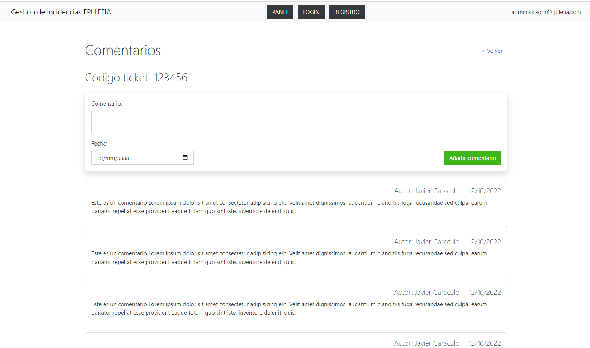

# Ejercicio 1 - Tickets

1. Crea un proyecto con npm init
2. Instala eslint
3. Crea un archivo index.html con las etiquetas header y main
4. Crea e importa el archivo main.js
5. Crea los componentes header
6. En el componente header crea un template correspondiente al del prototipo e inyéctalo desde main.js
7. Crea la vistaComentarios con un h1 y un h2 y el form para crear comentarios
8. Crea un archivo bd.js con array con comentarios y exportalo
9. Crea el componente comentario.js que recibirá: nombre, fecha y comentario
10. Crea el componente comentarios.js el cual debe importar la base de datos y crear un conjunto de comentarios (usando el componente comentario.js). Después cárgalo en index, debajo del formulario

