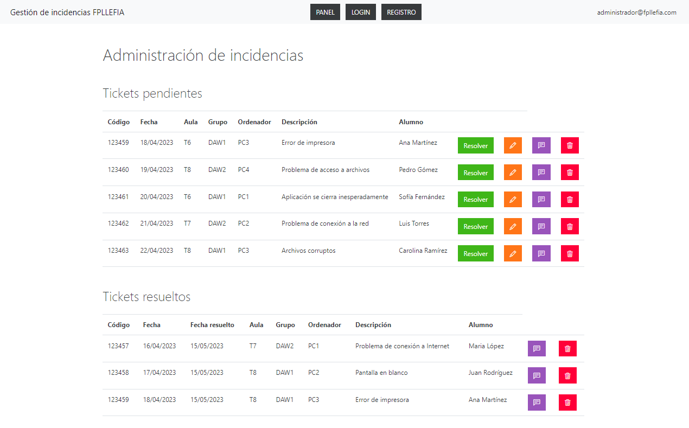
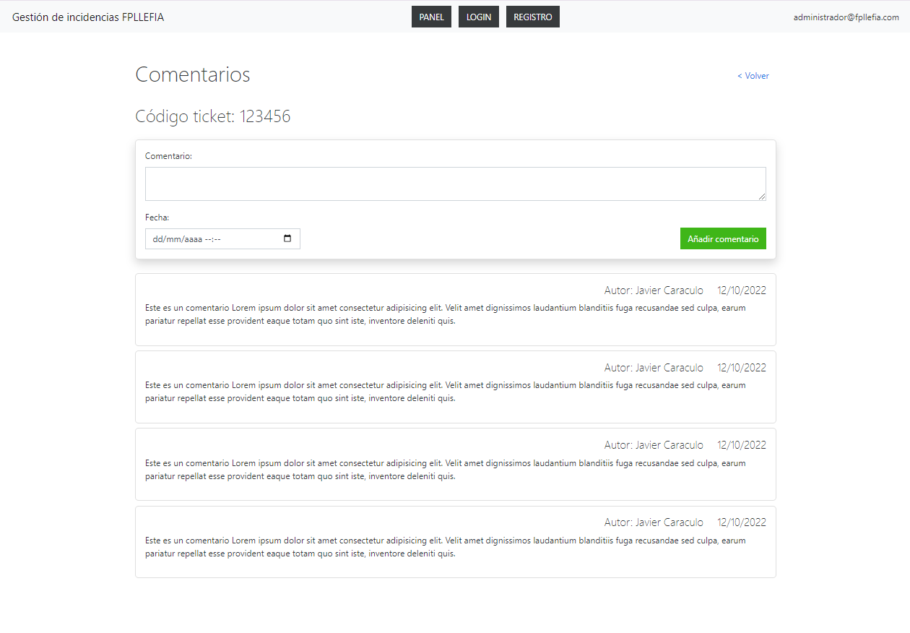
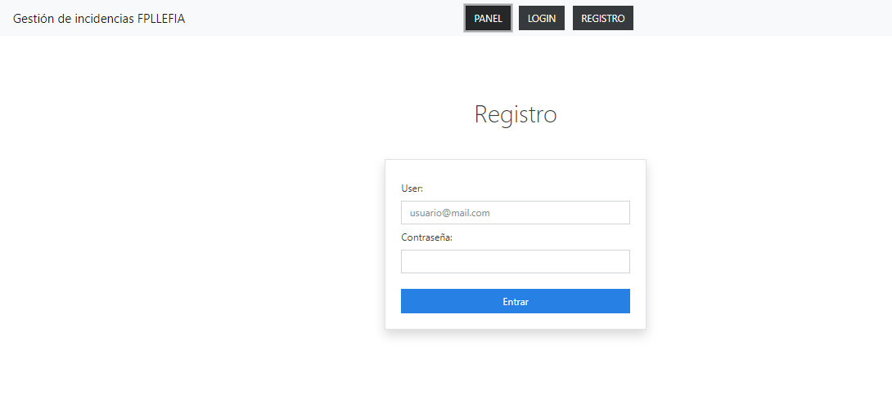
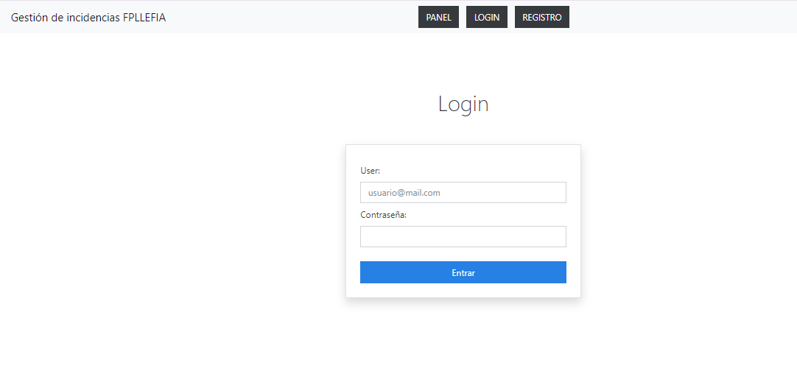

# PROJECTE:  Gestió d'incidències

## Especificacions del projecte

El nostre objectiu consisteix a desenvolupar una aplicació web que ens permeti enregistrar, fent servir el sistema de tiquets, les incidències o avaries que es detectin als equips d'una escola.
Els usuaris poden registrar-se a l'aplicació i, després d'iniciar la sessió, poden crear, mitjançant un formulari, un tiquet per obrir una incidència a un dels equips del centre.
Els usuaris amb rol 'professor' o 'administrador' poden veure els tiquets pendents i afegir comentaris.
L'usuari administrador pot, a més a més, editar o esborrar el tiquet. També pot resoldre'l de manera que el tiquet passi de la taula 'Tiquets pendents' a 'Tiquets resolts'.
Backlog de producte
Història 1 - Creació de components i vista 'Comentarios'
Història 2 - SPA. Creació d'un projecte amb Vite i desplegament
Història 3 - Llista de tiquets
Història 4 - Registre
Història 5 - Sessions
Història 6 - Lògica Tickets			

Història 1 - Creació de components i vista 'Comentarios'
Tasca 1 - Creació d'un projecte
Tasca 2 - Component Header
Tasca 3 - VistaComentarios
Tasca 4 - Simulació Base de dades
Tasca 5 - Component 'Comentario'
Tasca 6 - Component 'Comentarios'

Història 2 - SPA. Creació d'un projecte amb Vite i desplegament
Tasca 1. Projecte VITE. Repositori i desplegament
Tasca 2. Vista Panel
Tasca 3. Vista Registre
Tasca 4. Vista Login
Tasca 5. Component Header
Tasca 6. Lògica de header

Història 3 - Llista de tiquets
Tasca 1. Base de dades
Tasca 2. Taula de Tiquets

Història 4 - Registre
Tasca 1. Base de dades
Tasca 2. Registre Nou Usuari
Tasca 3. Missatges d'Èxit

Història 5 - Sessions
Tasca 1. Inici de Sessió i Correu al Capçalera
Tasca 2. Missatge d'Èxit
Tasca 3. Menú
Tasca 4.Tancar sessió
Història 6 - Lògica Tickets	